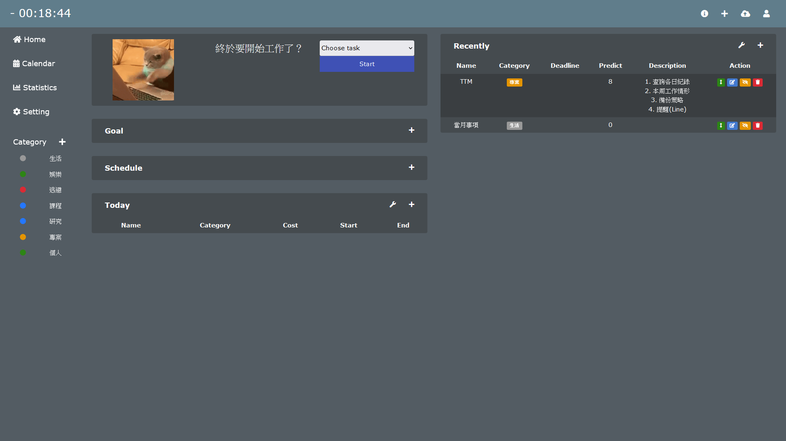

# TaskScheduler
A web for task scheduling and time management. A task could be defined as a work from any source(category) which has a deadline, and we can predict the time we may spend on it.

## Function
1. Timer: Start a task and time it. Once it is finished or stopped, the period would be recorde in "Today" block.
3. Today: Record how much time was spent on what tasks today.
2. Recently: Show tasks that are closer to their due date, usually within a week.
4. Schedule: Tasks to be performed today.
5. Goal: Tasks that are part of a long-term goal.
7. Slogan: User-defined sentences that can cheer up.

If the clock in the upper left corner shows a minus sign format, it means it's sleep time.

